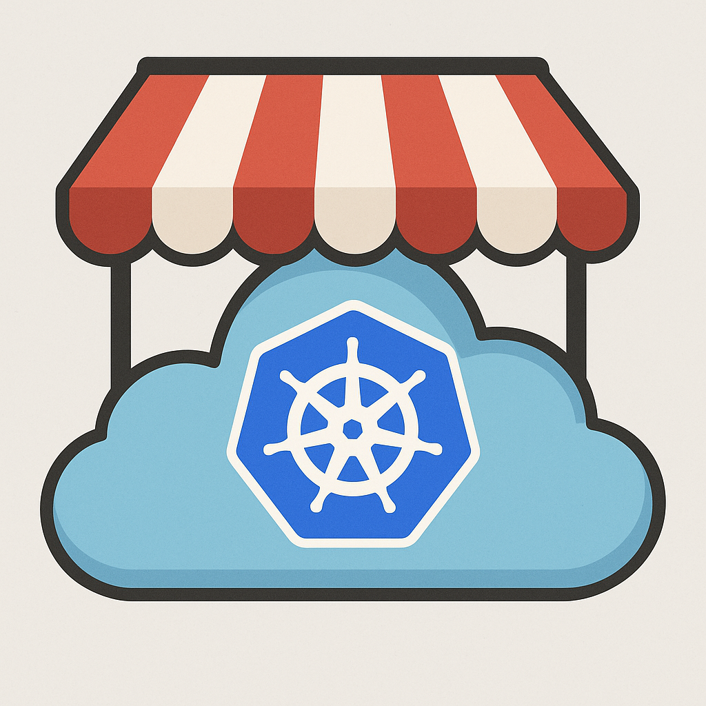

<div align="center">
  
  
  # 🚀 Open Service Portal
  
  **Your Self-Service Platform for Cloud-Native Services**
  
  [](https://backstage.io)
  [](https://github.com/open-service-portal)
  [](https://kubernetes.io)
</div>

---

## 🎯 Our Mission

We're building an **open-source Internal Developer Platform** that empowers developers to provision and manage cloud-native services through a unified, self-service portal. No more tickets, no more waiting - just click and deploy!

## 🛠️ What We're Building

### 🎭 **Backstage-Powered Platform**
Built on [Backstage](https://backstage.io), the open platform for building developer portals created by Spotify.

### 📦 **Key Features**
- **Software Templates** - Standardized blueprints for creating new services
- **Service Catalog** - Central registry of all your services, APIs, and resources  
- **Self-Service Infrastructure** - Provision databases, message queues, and more with a click
- **Developer Documentation** - Integrated TechDocs for all your services
- **GitHub Integration** - Seamless authentication and repository management

## 🚀 Getting Started

```bash
# Clone the workspace
git clone https://github.com/open-service-portal/portal-workspace.git
cd portal-workspace

# Clone the main application
git clone https://github.com/open-service-portal/app-portal.git
cd app-portal

# Install and start
yarn install
yarn start
```

Visit http://localhost:3000 to see your portal in action!

## 📚 Repositories

| Repository | Description | Status |
|------------|-------------|---------|
| [**app-portal**](https://github.com/open-service-portal/app-portal) | Main Backstage application |  |
| [**portal-workspace**](https://github.com/open-service-portal/portal-workspace) | Documentation and setup guides |  |

## 🤝 Contributing

We welcome contributions from the community! Whether you're fixing bugs, adding features, or improving documentation, we'd love to have you aboard.

- 🐛 [Report Issues](https://github.com/open-service-portal/app-portal/issues)
- 💡 [Discussions](https://github.com/orgs/open-service-portal/discussions)
- 📖 [Documentation](https://github.com/open-service-portal/portal-workspace/tree/main/docs)

## 🔧 Tech Stack

<div align="center">
  
| Component | Technology |
|-----------|------------|
| Framework | [Backstage](https://backstage.io) |
| Language | TypeScript |
| Runtime | Node.js 20 LTS |
| Database | PostgreSQL / SQLite |
| Container | Docker / Kubernetes |
| Auth | GitHub Apps |

</div>

## 📊 Project Status

This project is under active development. We're currently working on:
- ✅ GitHub App authentication
- ✅ Organization member import
- 🚧 Service templates
- 🚧 Kubernetes integration
- 📋 Cloud provider integrations

## 🌟 Why Open Service Portal?

- **Developer Experience First** - Built by developers, for developers
- **Open Source** - No vendor lock-in, full transparency
- **Extensible** - Add your own plugins and integrations
- **Production Ready** - Built on proven technologies

## 📬 Get in Touch

- 💬 [GitHub Discussions](https://github.com/orgs/open-service-portal/discussions)
- 🐛 [Issue Tracker](https://github.com/open-service-portal/app-portal/issues)

---

<div align="center">
  Made with ❤️ by the Open Service Portal Community
</div>